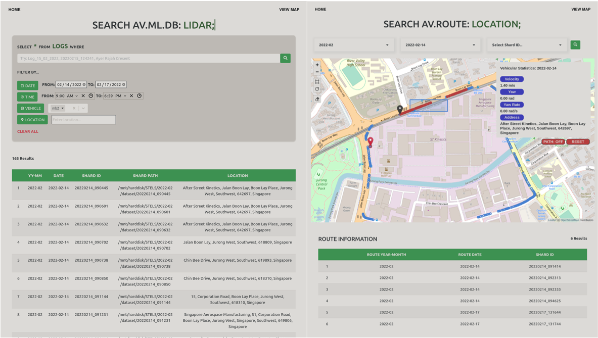

# End-to-End (E2E) Big Data Application for Autonomous Driving Data
This project aims to resolve shortcomings in data storage and management aspects by introducing a unified infrastructure to support storage of autonomous driving data where engineers are able to use, manage and transfer data in a controlled and efficient manner. This includes ETL data pipeline, improving data accessibility, creating data understanding and data visualisations.

# Architecture

# Web GUI

## Technologies Used
* Python
* PostgreSQL
* NodeJS
* Express
* Redis
* Docker
* ReactJS
* [Bootstrap 4](http://getbootstrap.com)
  * Leaflet Plugins:
    * [Geoman](https://github.com/geoman-io/leaflet-geoman)
